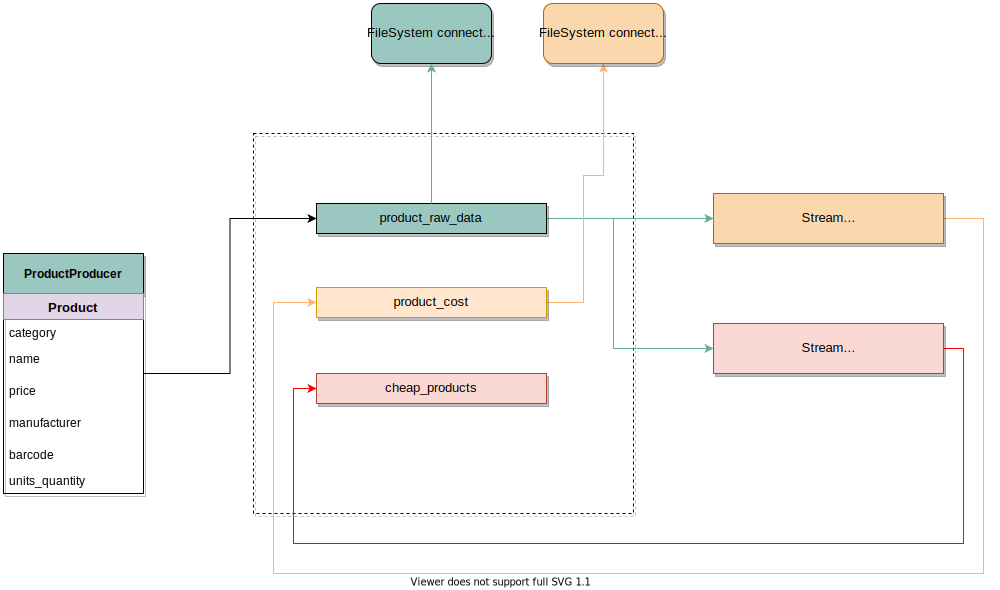

# Kafka homework repository

### Versions ready to check:
* a commit tagged `v1-min-required-tasks`

## Setup the cluster
```bash
$ docker-compose up -d
$ docker exec -it ksqldb-cli sh
$> ksql -f /tmp/ksql-init/bigDataCampStream.ksql http://ksqldb-server:8088
$> exit
$ ./prepare-file-sinks.sh  # will create **file** connectors for User
# run producers
```

\[_For now like this, later will be moved to a script_\]Prepare a connector for elastic:
```bash
$ curl -X POST -H "Content-Type: application/json" -d @connector-init/elastic-connector-sink.json localhost:8083/connectors
```

To start only specific containers:
```bash
$ docker-compose up -d elastic kibana
```


To run the producer:
```bash
$ cd producer  # otherwise schema/create-user-request.avsc will not be found
$ python main.py [-h, --help] [--topic TOPIC] [--bootstrap-servers BOOTSTRAP_SERVERS] [--schema-registry SCHEMA_REGISTRY] [--schema-file SCHEMA_FILE] [-g/--generator {user|product}]
```

Default values of the parameters:

```
topic - user-test-2
bootstrap-servers - localhost:9092
schema-registry - http://localhost:8081
schema-files - create-user-request.avsc
generator - user
```
Example of running producer for Products:
```bash
$ cd producer
$ python main.py --topic camp-products --schema-file create-product-request.avsc -g product
```

In case of running producers for Products, `prepare-file-sinks.sh` should be called with `--entity` argument:
```bash
$ ./prepare-file-sinks.sh --entity product
```

#### To install elastic connector:
```bash
$ docker exec -it connector sh
$> confluent-hub install confluentinc/kafka-connect-elasticsearch:11.1.2
# here select 2), then "y", "y", "y"
$> exit
```


### Products diagram


## Use kafka deployed in docker (cheatsheet)

### Where to get the `docker-compose.yml`:
```
$ curl --silent --output docker-compose.yml https://raw.githubusercontent.com/confluentinc/cp-all-in-one/6.2.1-post/cp-all-in-one-community/docker-compose.yml
$ docker-compose up -d  # to avoid holding stdin by the containers
```

### Create a topic:
```bash
# assuming zookeeper is running in a default zookeeper container (described in the docker-compose.yml)
$ docker-compose exec broker kafka-topics --create --zookeeper zookeeper:2181 --replication-factor 1 --partitions 1 --topic <topic_name>
```

### List topics:
```bash
# assuming zookeeper is running in a default zookeeper container (described in the docker-compose.yml)
$ docker-compose exec broker kafka-topics --list --zookeeper zookeeper:2181
```

### Use console consumer/producer:
```bash
# assuming the containers have the default names
$ docker exec -it broker sh
$> kafka-console-producer --topic <topic> --bootstrap-server <broker>  # localhost:9092
# OR
$> kafka-console-consumer --topic <topic> --bootstrap-server <broker>  # localhost:9092 --from-beginning
```
#### Or if to use *avro* consumer/producer:
```bash
# assuming the containers have the default names
$ docker exec -it schema-registry sh
$> kafka-avro-console-producer ...
$> kafka-avro-console-consumer ...
```

### Connect to KSQL Server using KSQL CLI:
```bash
# assuming the containers have the default names
$ docker exec -it ksqldb-cli sh
$> ksql http://ksqldb-server:8088  # docker-compose exec ksqldb-cli http://ksqldb-server:8088 does not enter anywhere
```


## KSQL Cheatsheet

### Show streams:
```sql
SHOW STREAMS;
```

### Show tables:
```sql
SHOW TABLES;
```

### Drop a stream:
```sql
DROP STREAM <stream-name>;
```

### Describe \[with details\] a stream
```sql
DESCRIBE <stream_name> [EXTENDED];
```

### Execute a script file:
```bash
# assuming the containers have the default names
$ docker exec -it ksqldb-cli sh
$> ksql -f <ksql_script_file>
```


## Work with connectors in containers (cheatsheet)
### Create a connector:
```bash
$ curl -X POST -H "Content-Type: application/json" -d @connector-init/file-connector-sink.json localhost:8083/connectors
```

> For a file connector specified paths will be prepared in the container with the connector server

Connectors [REST API](https://docs.confluent.io/platform/current/connect/references/restapi.html)